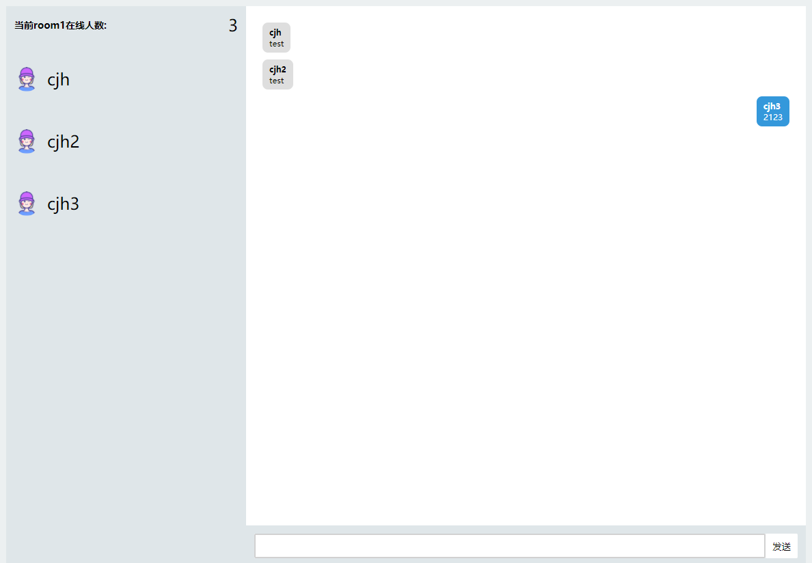
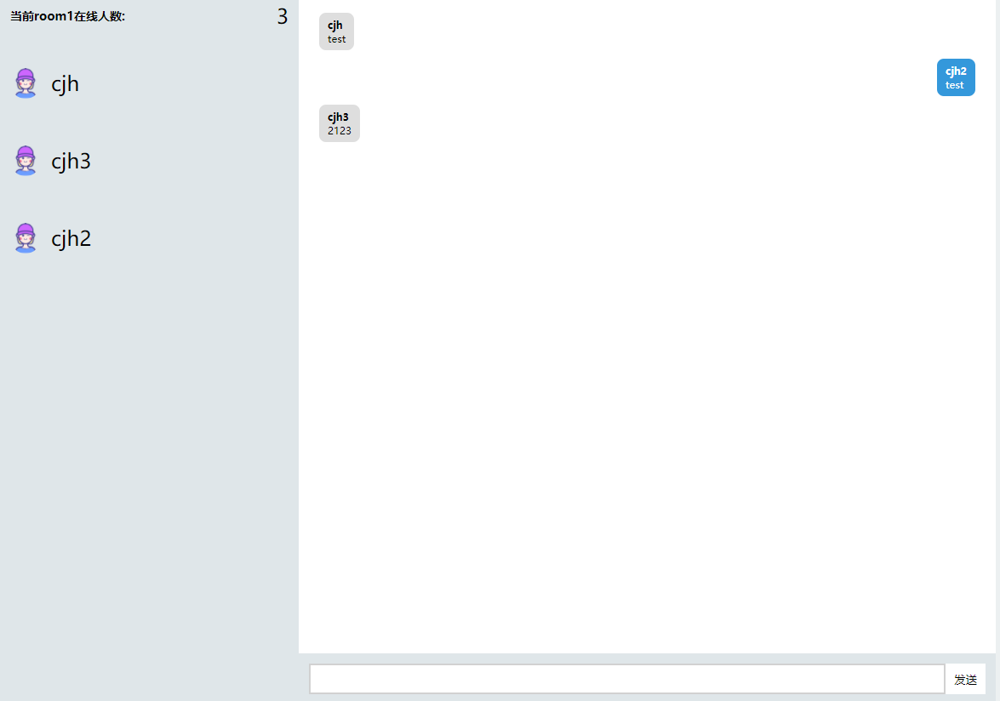
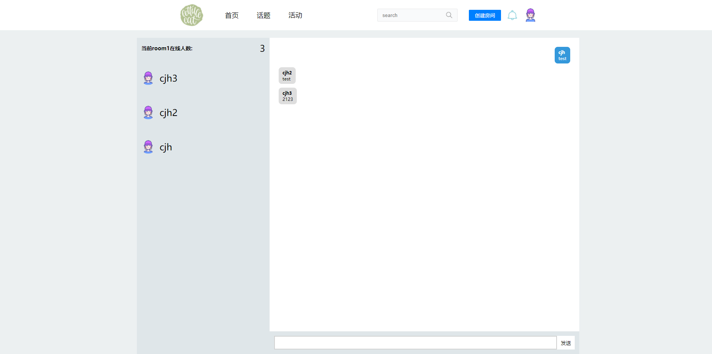

**使用deno 结合postgressql 实现简单的chat server**

## 前序准备

denon
```shell
deno install --allow-read --allow-run --allow-write --allow-net -f --unstable https://deno.land/x/denon/denon.ts
```

本地安装postgressql


## 启动
```shell
denon start
```




